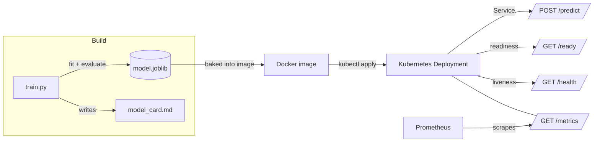

# mlops-model-serving

> An end-to-end MLOps demo: train a scikit-learn Iris classifier and serve it behind a production-shaped FastAPI REST API with health checks, Prometheus metrics, a Docker image, and Kubernetes manifests.


## Overview

`mlops-model-serving` is the bridge project between the ML and DevOps halves of
my portfolio. It takes a small, honest ML problem (the classic Iris dataset)
all the way through the operational path you would use for a real model:

1. **Train** a scikit-learn pipeline and persist it as a versionable artifact.
2. **Serve** it behind a REST API with liveness/readiness separation.
3. **Observe** it with Prometheus metrics.
4. **Package** it as a non-root Docker image with a healthcheck.
5. **Deploy** it to Kubernetes with probes, resource limits, and autoscaling.
6. **Automate** lint/test and image build in GitHub Actions.

The model itself is deliberately simple — the point is the plumbing around it.

## Architecture



## Features

- **FastAPI service** with typed request/response models (Pydantic v2).
- **Separated probes:** `/health` (liveness — process up) vs `/ready`
  (readiness — model artifact actually loaded).
- **Model metadata** at `/model` — version, algorithm, class names, feature
  count, and the artifact's trained-at timestamp for provenance/debugging.
- **Prometheus metrics** at `/metrics` (prediction counts, errors, latency).
- **Reproducible training** with a stratified holdout split and an
  auto-generated model card containing only metrics the code truly computes.
- **Hardened container:** multi-stage build, non-root user, read-only root
  filesystem in K8s, `HEALTHCHECK` baked in.
- **Kubernetes manifests:** Deployment (probes + requests/limits), Service,
  HorizontalPodAutoscaler, ConfigMap, and a Kustomization for `apply -k`.
- **CI:** lint + test on every push; a separate Docker build workflow.

## Tech stack

| Layer        | Technology                                   |
| ------------ | -------------------------------------------- |
| Model        | scikit-learn (`StandardScaler` + `LogisticRegression`), joblib |
| API          | FastAPI, Pydantic v2, Uvicorn                |
| Observability| prometheus-client                            |
| Packaging    | Docker (`python:3.11-slim`, multi-stage)     |
| Orchestration| Kubernetes (plain manifests + Kustomize)     |
| CI/CD        | GitHub Actions                               |
| Tests        | pytest + FastAPI `TestClient`                |

## Getting started

### Prerequisites

- Python 3.11+
- (Optional) Docker and a Kubernetes cluster / `kubectl`

### 1. Train the model

```bash
pip install -r requirements.txt
python train.py
```

This writes `model.joblib` and `model_card.md` to the repo root.

### 2. Run locally

```bash
uvicorn app.main:app --reload --port 8000
# Interactive docs: http://localhost:8000/docs
```

### 3. Build and run with Docker

The image trains the model at build time, so it is fully self-contained.

```bash
docker build -t mlops-model-serving:latest .
docker run --rm -p 8000:8000 mlops-model-serving:latest
```

### 4. Deploy to Kubernetes

```bash
# Build/push your own image and update the image ref in k8s/deployment.yaml.
kubectl apply -k k8s/
# or apply manifests individually:
kubectl apply -f k8s/
```

## Usage

```bash
curl -s -X POST http://localhost:8000/predict \
  -H "Content-Type: application/json" \
  -d '{"features": [5.1, 3.5, 1.4, 0.2]}'
```

Example response:

```json
{
  "class_id": 0,
  "class_name": "setosa",
  "probabilities": [0.97, 0.03, 0.00]
}
```

`features` is `[sepal length, sepal width, petal length, petal width]` in
centimetres. A payload without exactly four features returns HTTP 422.

Inspect what is being served with `GET /model`:

```bash
curl -s http://localhost:8000/model
```

```json
{
  "version": "0.1.0",
  "algorithm": "StandardScaler + LogisticRegression",
  "n_features": 4,
  "classes": ["setosa", "versicolor", "virginica"],
  "trained_at": "2026-08-06T12:00:00+00:00",
  "artifact_path": "/app/model.joblib"
}
```

## Observability

`GET /metrics` returns Prometheus text-format exposition, including:

- `model_predictions_total{predicted_class="..."}` — counter of predictions,
  labelled by predicted species.
- `model_prediction_errors_total` — counter of failed/invalid requests.
- `model_prediction_latency_seconds` — histogram of inference latency.
- Standard `prometheus-client` process/GC metrics.

The Deployment carries `prometheus.io/scrape` annotations so a cluster
Prometheus can auto-discover and scrape each pod.

## Project structure

```
mlops-model-serving/
├── app/
│   ├── __init__.py
│   ├── main.py          # FastAPI app: /health /ready /model /predict /metrics
│   └── model.py         # model load + inference (cached)
├── train.py             # train Iris -> model.joblib + model_card.md
├── tests/
│   └── test_api.py      # TestClient: health + predict + metrics
├── k8s/
│   ├── configmap.yaml
│   ├── deployment.yaml  # probes + resource requests/limits
│   ├── service.yaml
│   ├── hpa.yaml
│   └── kustomization.yaml
├── .github/workflows/
│   ├── ci.yml           # lint + test
│   └── docker.yml       # build image (push disabled by default)
├── Dockerfile
├── .dockerignore
├── requirements.txt
├── LICENSE
└── README.md
```

## Testing

```bash
pip install -r requirements.txt
pytest -q
```

The test suite trains a throwaway model into a temp directory, then exercises
`/health`, `/ready`, `/model`, `/predict` (valid + invalid inputs), and
`/metrics` through the FastAPI `TestClient` — no network or pre-existing
artifact needed.

## Roadmap

Honest next steps if this grew beyond a demo:

- **Model registry** — track and version artifacts (e.g. MLflow) instead of
  baking a single `model.joblib` into the image.
- **Canary rollout** — progressive delivery (Argo Rollouts / a service mesh)
  to shift traffic gradually to a new model version.
- **Input schema validation & drift monitoring** — reject out-of-distribution
  inputs and alert on feature drift.
- **Batch/async inference** endpoint for bulk scoring.

## License

MIT — see [LICENSE](LICENSE). Copyright (c) 2026 Matthews Wong.

---

Part of my cloud & AI portfolio — see [github.com/matthews-wong](https://github.com/matthews-wong).
